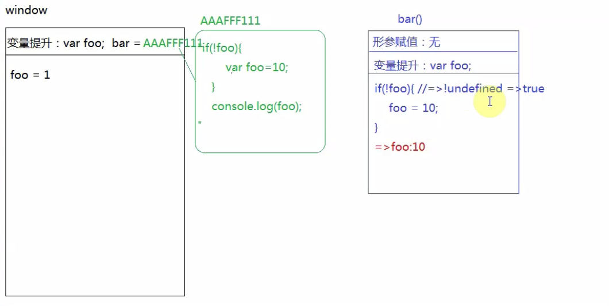
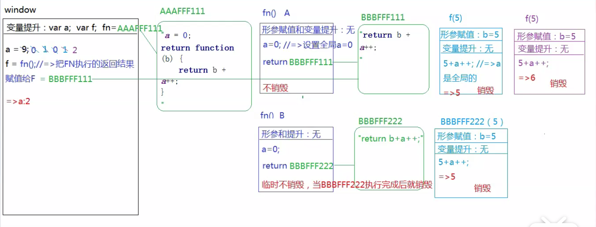

##### 1.变量提升和作用域

1.
```javascript
console.log(a)
var a = 12
function fn() {
  console.log(a)//私有作用域有a的变量声明后就会undefined，否则就是外作用域的12
  var a=13
}
fn()
console.log(a)
//undefined,undefined,12
```
2. 
```javascript
console.log(a)
var a = 12
function fn() {
  console.log(a)//私有作用域有a的变量声明后就会undefined，否则就是外作用域的12
}
fn()
console.log(a)
//undefined,12,12
```

3.
```javascript
console.log(a)
var a = 12
function fn() {
  console.log(a)
  a=13
}
fn()
console.log(a)
//undefined,12,13
```

4.
```javascript
console.log(a)
a = 12
function fn() {
  console.log(a)
  a=13
}
fn()
console.log(a)
//程序报错
```
5.
```javascript
var foo = 1
function bar() {
  if (!foo) {
    var foo=10
  }
  console.log(foo)
}
bar()
//10
//有点震惊啊，这个结果
```
> 因为：不管条件是否成立，都有变量提升！



6.
```javascript
//=>全局下的变量提升：var n,var c, a=AAAFFF11(引用地址)
var n = 0
function a() {
  //=>私有作用域：var n,b=BBBFFF11
  var n=10
  function b() {
    //=>私有作用域:无变量提升
    n++  //n是其上级作用域的
    console.log(n)
  }
  b()
  return b  // return BBBFFF11
}
var c = a()  //BBBFFF11
c()
console.log(n)
//11，12，0
```
7.
```javascript
// "use strict" //严格模式开启
var a = 4
function b(x, y, a) {
  console.log(a)
  arguments[2]=10 //a=10
  console.log(a)
}
a = b(1, 2, 3) //因为 b函数执行没有返回值
console.log(a)
//3，10，undefined
//3，3，undefined  //严格模式开启时的结果
```
> 在JS的非严格模式下，函数的实参集合(arguments)与形参变量存在"映射"关系,即不管其中谁改变了，另外一个也会跟着发生改变
> 在JS的严格模式下，函数的实参集合(arguments)与形参变量的"映射"关系被切断了，相互之间互不干扰

- 逻辑与(&&)的优先级高于逻辑或(||)

8.
```javascript
var a = 9
function fn() {
  a = 0
  return function (b) {
    // return b + a++  
    return b + ++a
  }
}
var f = fn()
console.log(f(5))
console.log(fn()(5))
console.log(f(5))
console.log(a)

//5,5,6,2
//return b + ++a  =>6,6,7,2,++a 先自加再运算，a++ 先运算，再自加
```



9.
```javascript
function fn(i) {
  return function (n) {
    console.log(n+ i++)
  }
}
var f = fn(10)
f(20)
fn(20)(40)
fn(30)(50)
f(30)
//30,60,80,41
```
