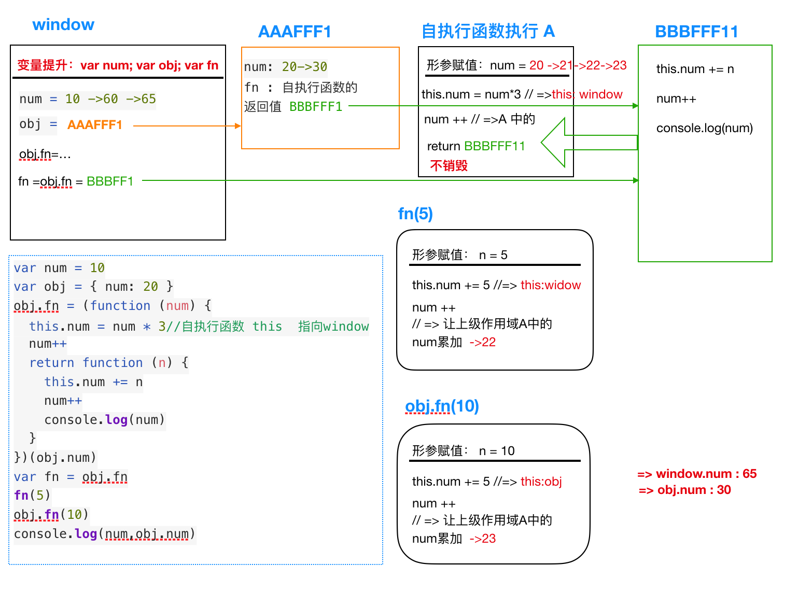

##### 1.闭包和this示例
```javascript
var num = 10
var obj = { num: 20 }
obj.fn = (function (num) {
  this.num = num * 3
  num++
  return function (n) {
    this.num += n
    num++
    console.log(num)
  }
})(obj.num)
var fn = obj.fn
fn(5)
obj.fn(10)
console.log(num,obj.num)
//浏览器中的执行结果是 22，23，65，30
//node 环境中的执行结果是 22，23，10，30 （没有window,所以最外层的num没有被修改)
```



##### 2.this指向问题
>当你要确定“函数中的this是什么”的时候，永远不要到函数定义的地方去找答案！而是要到函数被调用的地方找答案！

>具体说：函数里面的this的含义，是由它被调用的方式决定的。
换句话说，当你看到下面的代码时：

`a.f();`

你就可以确定f里面的this就是指a，而不管f是个什么玩意。当你看到下面的代码时：

`f();`

你就可以确定(不考虑bind，以及严格模式时情况下)，f里面的this就是指全局对象window。

所以，函数定义的方式(通过函数声明、函数表达式、new Function)与this的确定无关，有没有闭包也与this无关！

最后说一句：“this是由被调用的方式确定”这个事实，使得this可以被改变，从而为函数增加了动态性、可变性，使得编程更加灵活。

##### 3.作用域的销毁

>关于JS中作用域的销毁和不bai销毁的情du况总结
window全局作用域zhi->页面关掉才销毁dao
函数执行会形成私有的作用域

- 1)作用域的销毁
一般情况下，函数执行形成一个私有的作用域，当执行完成后就销毁了->节省内存空间

- 2)作用域的不立即销毁
```javascript
function fn(){
  var i=10;
  return function(n){
    console.log(n+i++);
  }
}
```

fn()(15);//->先执行fn,有一个私有的变量i=10,返回一个堆内存地址 xxxfff111,我们发现这个地址还用到了一次,那么当前的这个fn形成私有作用域（A）就不能立即销毁了,xxxfff111(15)->输出25,A中的i变为11；当xxxfff111执行完了,发现这个地址没用了,浏览器就把A、xxxfff111都释放了
fn()(20);//->在执行fn的时候一切都从新开始了,和上面的步骤是一样的->输出30

- 3)作用域的不销毁：形成一个私有作用域,里面的内容被外面占用了
```javascript
function fn(){
  var i=10;
  return function(n){
    console.log(n+i++);
  }
}
```
var f=fn();//->fn执行形成一个私有的作用域A,A中有一个私有的变量i=10,A中返回一个地址xxxfff11,被外面的f占用了,那么当前的A就不能销毁了

`f(15);//->输出25,让A中的i=11`
`f(20);//->输出31,让A中的i=12`

...

当我们知道f用完的时候,为了优化性能,我们让f=null,这样的话A中的xxxfff111没人占用了,浏览器会把A和xxxfff111都释放了


##### 4.用友面试题
```javascript
var fullName ="language"
var obj = {
  fullName: 'javascrpt',
  prop: {
    fullName:"ee",
    getFullName: function () {
      return this.fullName
    }
  }
}
console.log(obj.prop.getFullName())//undefined
var test = obj.prop.getFullName
console.log(test())//language  ,node环境：undefined
```

```javascript
var fullName ="language"
var Tom = {
  fullName: 'javascrpt',
  show: function () {
    console.log(this.fullName)
  },
  wait: function(){
    var func = this.show
    func()
  }
}
Tom.wait() //language  , node环境: undefined
//Tom.wait()=>this:Tom =>func = Tom.show=>func()=>this:window  =>window.name
//方法执行，不管他在哪里就看，前面有没有. 没有. this就是指向window
```

##### 5.腾讯面试题（很简单）
```javascript
function fun() {
  this.a = 0
  this.b = function () {
    alert(this.a)
  }
}

fun.prototype = {
  b: function () {
    this.a = 20
    alert(this.a)
  },
  c: function () {
    this.a = 30
    alert(this.a)
  }
}

var myfun = new fun()
myfun.b()//0 (浏览器,node没有alert)
myfun.c()//30 (浏览器,node没有alert)
```