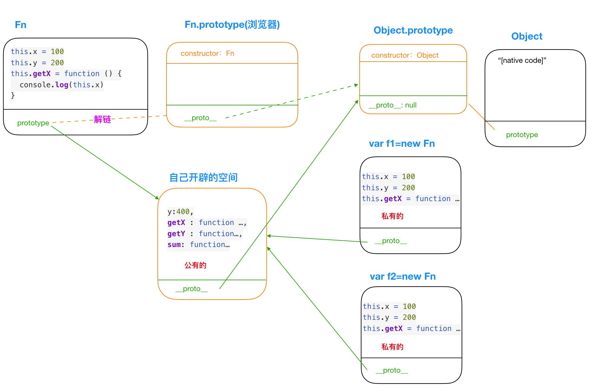

```javascript
//自己开始做的时候一次全对 2020.10.19
function Fn() {
  this.x = 100
  this.y = 200
  this.getX = function () {
    console.log(this.x)
  }
}

Fn.prototype.getX = function () {
  console.log(this.x)
}
Fn.prototype.getY = function () {
  console.log(this.y)
}

var f1 = new Fn()
var f2 = new Fn()

console.log(f1.getX === f2.getX)//false
console.log(f1.getY === f2.getY)//true
console.log(f1.__proto__.getX === f2.__proto__.getX)//true
console.log(f1.__proto__.getY === f2.__proto__.getY)//true
console.log(f1.constructor)//Function Fn(){}...
console.log(Fn.prototype.__proto__.constructor)//Function(){} Object
f1.getX()//100
f1.__proto__.getX()//undefined
f2.getY()//200
Fn.prototype.getY()//undefined

//执行答案：
// false
// true
// true
// true
// [Function: Fn]
// [Function: Object]
// 100
// undefined
// 200
// undefined

```


升级！

```javascript
function Fn() {
  this.x = 100
  this.y = 200
  this.getX = function () {
    console.log(this.x)
  }
}
// Fn.prototype = 解链了原来的prototype,导致没了constructor
Fn.prototype = {
  y:400,
  getX : function () {
    console.log(this.x)
  },
  getY : function () {
    console.log(this.y)
  },
  sum: function () {
    console.log(this.x+this.y)
  }
}

var f1 = new Fn()
var f2 = new Fn()

console.log(f1.getX === f2.getX)//false
console.log(f1.getY === f2.getY)//true
console.log(f1.__proto__.getY === Fn.prototype.getY)//true
console.log(f1.__proto__.getX === f2.getX)//false
console.log(f1.getX === Fn.prototype.getX)//false
console.log(f1.constructor)//Object
console.log(Fn.prototype.__proto__.constructor)//Object
f1.getX()//100
f1.__proto__.getX()//undefined
f2.getY()//200
Fn.prototype.getY()//400
```
